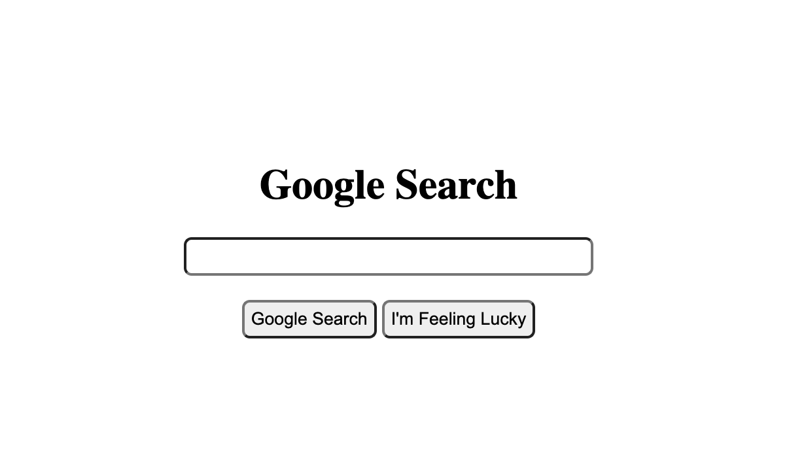
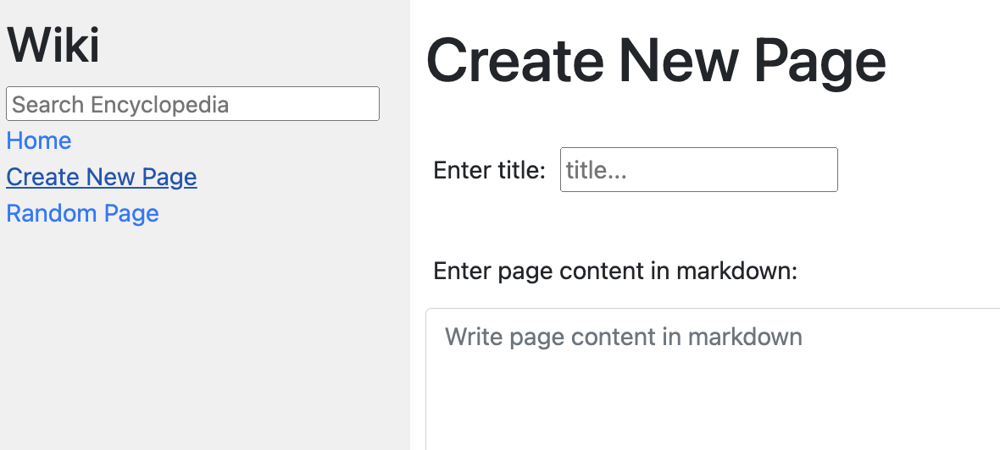
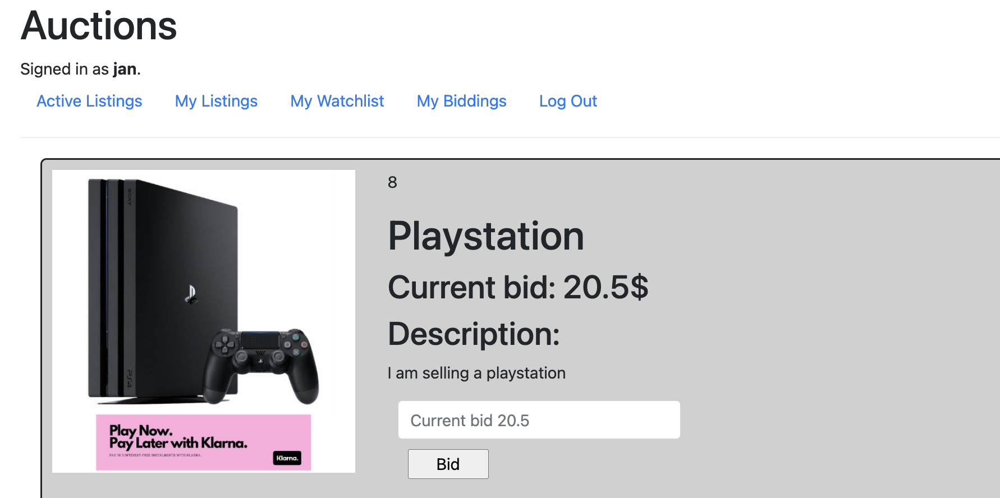
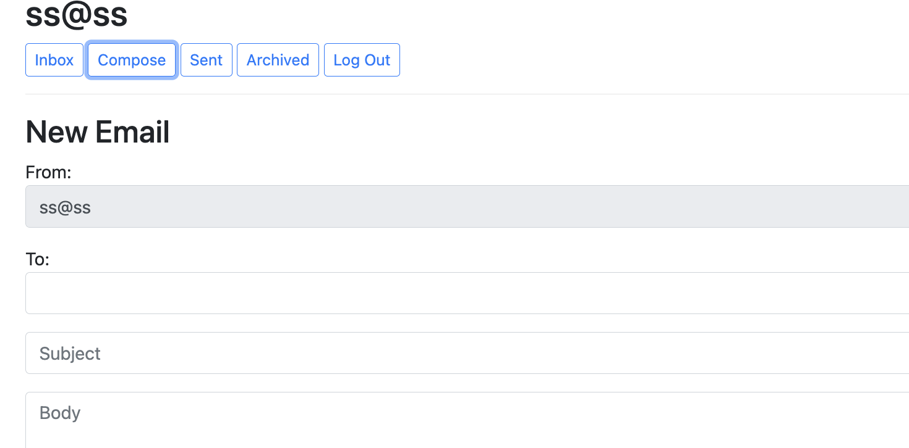

To get started with web development and learn React, Django, HTML, and CSS I enrolled in Harvard CS50W web development online course (https://cs50.harvard.edu/web/2020/). 

During this course I developed 5 mini projects:

## 1. Google wraper

Read more about this project here: 

## 2. Wikipedia page

Read more about this project here: 

## 3. E-commerce website

Read more about this project here: 

## 4. Email client

Read more about this project here: 

## 5. Twitter like social network

Read more about this project here: 
